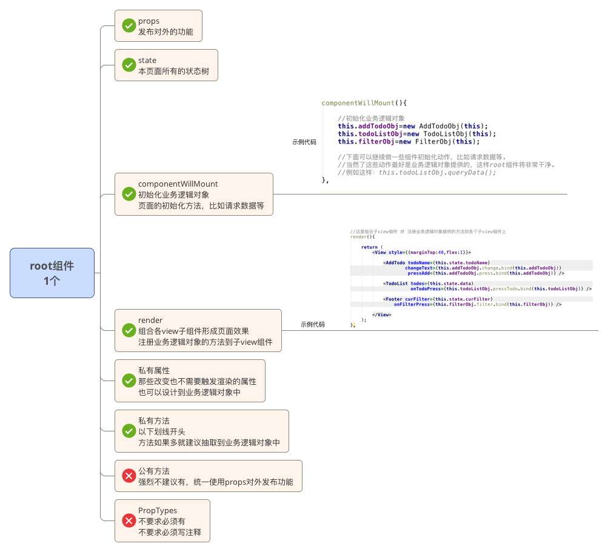

#ReactNative开发规范


##组件/页面结构

### 业务页面/组件开发规范

 一个独立完整的组件\页面一般由以下元素构成：
 
1. root组件，1个， 
	1. 负责初始化state
	2. 负责提供对外props列表
	2. 负责组合子view组件形成页面效果
	3. 负责注册业务逻辑对象提供的业务逻辑方法
	4. 负责管理业务逻辑对象
1. view子组件，0-n个，
	1. 根据props进行视图的渲染
1. 业务逻辑对象，0-n个，
	2. 提供业务逻辑方法 

		
####root组件
root组件由以下元素组成：

1. props-公有属性
2. state-RN体系的状态,必须使用Immutable对象
3. 私有属性
4. 业务逻辑对象的引用-在componentWillMount中初始化
4. 私有方法-以下划线开头，内部使用or传递给子组件使用
5. 公有方法【不推荐】，子组件和外部组件都可以用，但不推荐用公有方法来对外发布功能，破坏了面向状态编程，尽可能的使用props来发布功能





####子view组件

子view组件中包含：

1. props-公有属性
2. 私有属性-强烈不建议有，除非你能理解以下几点，建议放在父组件or业务逻辑对象中
	3. 绝对不允许和父组件的属性or状态有冗余。无论是显性冗余还是计算结果冗余，除非你能确定结算是性能的瓶颈。
	4. 此属性只有自己会用，父组件和兄弟组件不会使用，如果你不确定这点，请把这个组件放到父组件上，方便组件间通信
3. 私有方法-仅作为渲染view的使用，不许有业务逻辑
4. 公有方法【不推荐，理由同root组件】 


	

	
####业务逻辑对象
业务逻辑对象由以下元素组成：

3. root组件对象引用-this.root
2. 构造器-初始化root对象，初始化私有属性
2. 私有属性
3. 公有方法-对外提供业务逻辑
3. 私有方法-以下划线开头，内部使用

	


	
	
###通用组件开发规范
	
参考业务开发规范，尽量遵守，灵活调整。
	
PropTypes ，必须要有且必须要写注释。

公用方法不推荐有，理由同业务开发规范，如果有，要求写注释。


###相关参考地址

https://github.com/cnsnake11/blog/blob/master/ReactNative开发指导/ReactNative的架构设计.md

https://github.com/cnsnake11/blog/blob/master/ReactNative开发指导/ReactNative组件状态设计思考.md

##组件引入

使用import

尽量用解构赋值React和BbtReact

```javascript
// bad
import Footer from './Component/Footer/FooterView'

// good
import Footer from './Component/Footer/Footer'

//good
import HomeView from './HomeView';

//good
import css from './HomeView.css';

//good
import * as HomeViewAction from './HomeView.action';

```

##样式

一般情况建议使用行内样式

用style={[]}来定义样式，方便后期添加新样式

如果有复用，抽取为样式类，一般使用css来命名，例如var css=StyleSheet.create()

如果复用的样式较多，请将样式抽取到单独文件：组件名.css.js


### 组件声明
  - 使用class与extends关键字。不使用React.createClass方法。需要导出的组件直接在class关键字前使用export default。
    ```javascript
    // bad
    export default React.createClass({
    });

    // good
    export default class HomeView extends React.Component {
    }
    ```

### 对齐
  - 按下面的案例对齐：

    ```javascript
    // bad
    <Foo superLongParam="bar"
         anotherSuperLongParam="baz" />

    // good
    <Foo
      superLongParam="bar"
      anotherSuperLongParam="baz"
    />

    // 如果一行能摆下props，那就摆在一行
    <Foo bar="bar" />

    // 子组件照常缩进
    <Foo
      superLongParam="bar"
      anotherSuperLongParam="baz"
    >
      <Spazz />
    </Foo>
    ```

### 引号
  - 对于JSX的字符串属性使用双引号(`"`)，其他情况下使用单引号。

    ```javascript
    // bad
    <Foo bar='bar' />

    // good
    <Foo bar="bar" />

    // bad
    <Foo style={{ left: "20px" }} />

    // good
    <Foo style={{ left: '20px' }} />
    ```

### 空格
  - 在自闭合的标签中包含一个空格。
    ```javascript
    // bad
    <Foo/>

    // very bad
    <Foo                 />

    // bad
    <Foo
     />

    // good
    <Foo />
    ```

### state/props
  - 对于多个单词组成的pros，使用驼峰命名法。不使用下划线或连接线。
    ```javascript
    // bad
    <Foo
      UserName="hello"
      phone_number={12345678}
    />

    // good
    <Foo
      userName="hello"
      phoneNumber={12345678}
    />
    ```
  - 读取state和props时，使用const与解构，必要时可使用let。不使用var。
    ```javascript
    // bad
    var userName = this.props.userName;
    let checked = this.state.checked;

    // good
    const { userName, age, sex } = this.props;
    const { checked } = this.state;
    ```  
    
### 括号
  - 当JSX标签超过一行时，使用括号包裹。
    ```javascript
    /// bad
    render() {
      return <MyComponent className="long body" foo="bar">
               <MyChild />
             </MyComponent>;
    }

    // good
    render() {
      return (
        <MyComponent className="long body" foo="bar">
          <MyChild />
        </MyComponent>
      );
    }

    // good, when single line
    render() {
      const body = <div>hello</div>;
      return <MyComponent>{body}</MyComponent>;
    }
    ```

### 标签
  - 对于没有子组件的JSX标签，始终自闭合。
    ```javascript
    // bad
    <Foo className="stuff"></Foo>

    // good
    <Foo className="stuff" />
    ```

  - 如果组件有多行属性，则另起一行进行自闭合。
    ```javascript
    // bad
    <Foo
      bar="bar"
      baz="baz" />

    // good
    <Foo
      bar="bar"
      baz="baz"
    />
    ```

### 方法
  - 为方法命名时，不使用下划线开头（哪怕是想用作私有方法）。
    ```javascript
    // bad
    React.createClass({
      _onClickSubmit() {
        // do stuff
      }

      // other stuff
    });

    // good
    class extends React.Component {
      onClickSubmit() {
        // do stuff
      }

      // other stuff
    });
    ```

### 方法声明的顺序

  - 原则上按如下顺序排列React组件的各个方法（生命周期）：
  
  1. constructor
  1. 静态方法（static methods)
  1. getChildContext
  1. componentWillMount
  1. componentDidMount
  1. componentWillReceiveProps
  1. shouldComponentUpdate
  1. componentWillUpdate
  1. componentDidUpdate
  1. componentWillUnmount
  1. 点击处理或事件处理函数，比如onClickSubmit()、onChangeDescription()
  1. 用在render中的getter方法，比如getSelectReason()、getFooterContent()
  1. 可选的render方法，比如renderNavigation()、renderProfilePicture()
  1. render

  - 按如下方式定义propTypes, defaultProps, contextTypes等  

  ```javascript
  import React, { Component, PropTypes } from 'react';
  
  const propTypes = {
    id: PropTypes.number.isRequired,
    url: PropTypes.string.isRequired,
    text: PropTypes.string,
  };
  
  const defaultProps = {
    text: 'Hello World',
  };
  
  class Link extends Component {
    static methodsAreOk() {
      return true;
    }
  
    render() {
      return <a href={this.props.url} data-id={this.props.id}>{this.props.text}</a>
    }
  }
  
  Link.propTypes = propTypes;
  Link.defaultProps = defaultProps;
  
  export default Link;
  ```


##业务逻辑类创建
使用 class AaaObj extends BaseLogicObj 的方式创建

首字母大写，以Obj结尾

##页面初始化

使用交互管理器保证转场动画流畅，页面直接显示loading和少量的不变组件比如header等，其余的渲染动作放到转场动画结束后执行。

如果页面有初始化数据，请立即执行请求，不要等转场动画结束执行。

##与服务器交互
统一使用fetch方法

##图片
静态图直接打包入app，使用相对路径的方式引入，source={require('相对路径')}

注意：服务器上的图注意必须要有高宽才能显示出来

##盒子模型属性

一定要尽可能的在view组件上写盒子模型属性,虽然有可能会造成标签冗余，但是不会出各种诡异问题。

text元素就不要写盒子模型属性，支持的很诡异


##touch*组件

onpress事件只能加在touch*组件上

一般不使用TouchHighlight，优先使用TouchOpacity

touch*一般包在view外面，如要加padding在view上，加margin加在touch*上


##jsx

不能写if else，可以用条件表达式代替

经常用array.map方式来渲染数组
	
参考地址：http://segmentfault.com/a/1190000003748270

##定时任务
不允许使用window.setTimeout和window.setInterval

要求使用TimerMixin

参考地址：https://github.com/cnsnake11/blog/blob/master/ReactNative翻译/react-native的定时器.md

