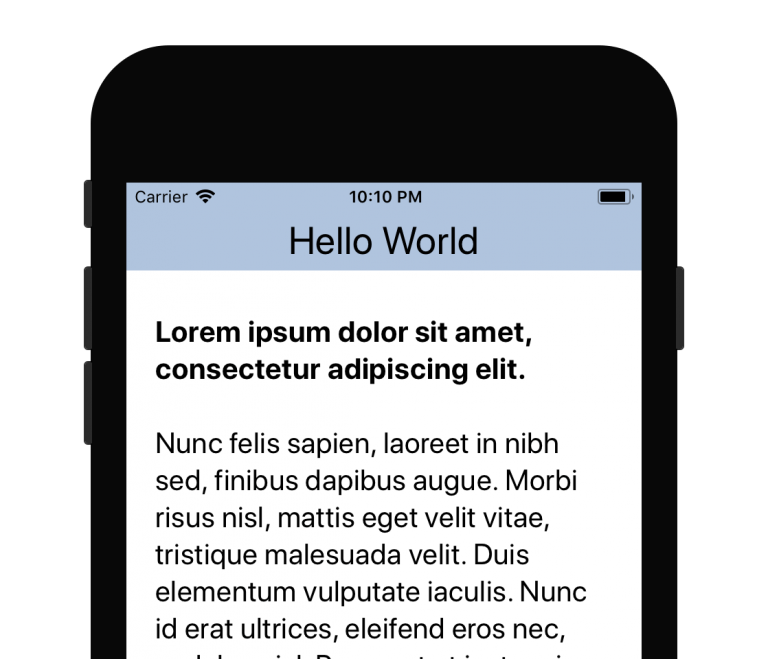
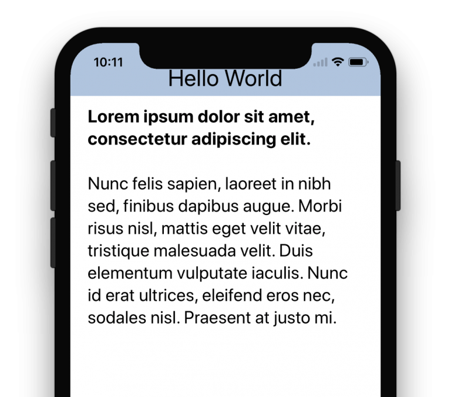
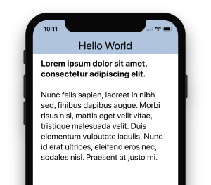

# 【翻译】Understanding the WebView Viewport in iOS 11（part 2）

# 理解ios11中的webview viewport（第二部分）

原文地址：http://ayogo.com/blog/ios11-viewport/

书接上回。

# iOS 11 Fixes 如何修改呢

Luckily, Apple gave us a way to control this behaviour via the viewport meta tag. Even more luckily, they even backported this new viewport behaviour fix to the older, deprecated UIWebView!

还好，苹果给了我们解决办法，通过使用viewport的meta标签来解决这个问题。而且，在已经废弃的老版本的UIWebview中，也支持了这种方法。

The viewport option you’ll be looking for is viewport-fit. It has three possible values:

具体来说就是在viewport标签中使用viewport-fit属性，这个属性可以设置三个值：

1. contain: The viewport should fully contain the web content. This means position fixed elements will be contained within the safe area on iOS 11.
2. cover: The web content should fully cover the viewport. This means position fixed elements will be fixed to the viewport, even if that means they will be obscured. This restores the behaviour we had on iOS 10.
3. auto: The default value, in this case it behaves the same as contain.

1. contain：视窗会将内容显示全。也就是说，fixed元素会基于安全区域定位。【译者注：也就是会基于状态栏的下边框定位，在非iphoneX上会距离屏幕顶部20px，ihponeX下距离屏幕顶部44px】
2. cover：内容会尽量的铺满整个视窗。此种情况，fixed元素会基于屏幕边缘定位，内容会被屏幕的状态栏或者iphoneX的感应条挡住。ios7~ios10其实就是这种模式。
3. auto：默认值，与contain的行为一致。

So to restore your header bar to the very top of the screen, behind the status bar like it was in iOS 10, you’ll want to add viewport-fit=cover to your viewport meta tag.

所以，如果想让header bar充满屏幕的最上面，就像在ios10那样，只需要在viewport的标签中加入viewport-fit=cover。


图：Looking good with viewport-fit set to cover in iOS 11 on an iPhone 8。设置viewport-fit=cover后，iphone8的显示就正常了。

# iPhone X

But what about the iPhone X with its irregular shape? The status bar is no longer 20px tall, and with the inset for the camera and speaker, your header bars contents will be entirely inaccessible to users. It’s important to note that this also applies to footer bars pinned to the bottom of the screen, which will be obstructed by the microphone.

Note: Your app will only use the full screen space on the iPhone X if you have a launch storyboard. Existing apps will be shown in a view box with black space at the top and bottom.


图：iPhone X brings some new challenges, even with viewport-fit set to cover.

Luckily, Apple added a way to expose the safe area layout guides to CSS. They added a concept similar to CSS variables, originally called CSS constants. Think of these like CSS variables that are set by the system and cannot be overridden. They were proposed to the CSS Working Group for standardization, and accepted with one change: instead of using a function called constant() to access these variables, they’ll use a function called env().

Note: iOS 11.0 uses the constant() syntax, but future versions will only support env()!

The 4 layout guide constants are:

1. env(safe-area-inset-top): The safe area inset amount (in CSS pixels) from the top of the viewport.
2. env(safe-area-inset-bottom): The safe area inset amount (in CSS pixels) from the bottom of the viewport.
3. env(safe-area-inset-left): The safe area inset amount (in CSS pixels) from the left of the viewport.
4. env(safe-area-inset-right): The safe area inset amount (in CSS pixels) from the right of the viewport.
	
Apple’s final gift to us is that these variables have also been backported to UIWebView.

# Example with CSS constants

Let’s say you have a fixed position header bar, and your CSS for iOS 10 currently looks like this:

```
header {
    position: fixed;
    top: 0;
    left: 0;
    right: 0;
    height: 44px;

    padding-top: 20px; /* Status bar height */
}

```

To make that adjust automatically for iPhone X and other iOS 11 devices, you would add a viewport-fit=cover option to your viewport meta tag, and change the CSS to reference the constant:

```
header {
    /* ... */

    /* Status bar height on iOS 10 */
    padding-top: 20px;

    /* Status bar height on iOS 11.0 */
    padding-top: constant(safe-area-inset-top);

    /* Status bar height on iOS 11+ */
    padding-top: env(safe-area-inset-top);
}
```

It’s important to keep the fallback value there for older devices that won’t know how to interpret theconstant() or env() syntax. You can also use constants in CSS calc() expressions.


图：iPhone X fixed with automatic device padding added.

You would also want to remember to do this for bottom navigation bars as well.

