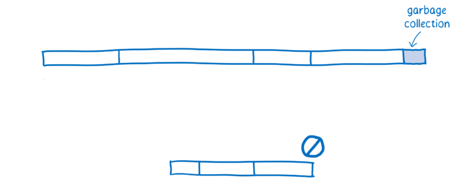

# [翻译]WebAssembly(5-2) What makes WebAssembly fast?

# Compiling + optimizing

As I explained in the article about the JIT, JavaScript is compiled during the execution of the code. Depending on what types are used at runtime, multiple versions of the same code may need to be compiled.

Different browsers handle compiling WebAssembly differently. Some browsers do a baseline compilation of WebAssembly before starting to execute it, and others use a JIT.

Either way, the WebAssembly starts off much closer to machine code. For example, the types are part of the program. This is faster for a few reasons:

	1.	The compiler doesn’t have to spend time running the code to observe what types are being used before it starts compiling optimized code.
	2.	The compiler doesn’t have to compile different versions of the same code based on those different types it observes.
	3.	More optimizations have already been done ahead of time in LLVM. So less work is needed to compile and optimize it.

# Reoptimizing

Sometimes the JIT has to throw out an optimized version of the code and retry it.

This happens when assumptions that the JIT makes based on running code turn out to be incorrect. For example, deoptimization happens when the variables coming into a loop are different than they were in previous iterations, or when a new function is inserted in the prototype chain.

There are two costs to deoptimization. First, it takes some time to bail out of the optimized code and go back to the baseline version. Second, if that function is still being called a lot, the JIT may decide to send it through the optimizing compiler again, so there’s the cost of compiling it a second time.

In WebAssembly, things like types are explicit, so the JIT doesn’t need to make assumptions about types based on data it gathers during runtime. This means it doesn’t have to go through reoptimization cycles.

# Executing

It is possible to write JavaScript that executes performantly. To do it, you need to know about the optimizations that the JIT makes. For example, you need to know how to write code so that the compiler can type specialize it, as explained in the article on the JIT.

However, most developers don’t know about JIT internals. Even for those developers who do know about JIT internals, it can be hard to hit the sweet spot. Many coding patterns that people use to make their code more readable (such as abstracting common tasks into functions that work across types) get in the way of the compiler when it’s trying to optimize the code.

Plus, the optimizations a JIT uses are different between browsers, so coding to the internals of one browser can make your code less performant in another.
Because of this, executing code in WebAssembly is generally faster. Many of the optimizations that JITs make to JavaScript (such as type specialization) just aren’t necessary with WebAssembly.

In addition, WebAssembly was designed as a compiler target. This means it was designed for compilers to generate, and not for human programmers to write.

Since human programmers don’t need to program it directly, WebAssembly can provide a set of instructions that are more ideal for machines. Depending on what kind of work your code is doing, these instructions run anywhere from 10% to 800% faster.

# Garbage collection

In JavaScript, the developer doesn’t have to worry about clearing out old variables from memory when they aren’t needed anymore. Instead, the JS engine does that automatically using something called a garbage collector.

This can be a problem if you want predictable performance, though. You don’t control when the garbage collector does its work, so it may come at an inconvenient time. Most browsers have gotten pretty good at scheduling it, but it’s still overhead that can get in the way of your code’s execution.

At least for now, WebAssembly does not support garbage collection at all. Memory is managed manually (as it is in languages like C and C++). While this can make programming more difficult for the developer, it does also make performance more consistent.

# Conclusion

WebAssembly is faster than JavaScript in many cases because:

	•	fetching WebAssembly takes less time because it is more compact than JavaScript, even when compressed.
	•	decoding WebAssembly takes less time than parsing JavaScript.
	•	compiling and optimizing takes less time because WebAssembly is closer to machine code than JavaScript and already has gone through optimization on the server side.
	•	reoptimizing doesn’t need to happen because WebAssembly has types and other information built in, so the JS engine doesn’t need to speculate when it optimizes the way it does with JavaScript.
	•	executing often takes less time because there are fewer compiler tricks and gotchas that the developer needs to know to write consistently performant code, plus WebAssembly’s set of instructions are more ideal for machines.
	•	garbage collection is not required since the memory is managed manually.

This is why, in many cases, WebAssembly will outperform JavaScript when doing the same task.

There are some cases where WebAssembly doesn’t perform as well as expected, and there are also some changes on the horizon that will make it faster. I’ll cover those in the next article.

