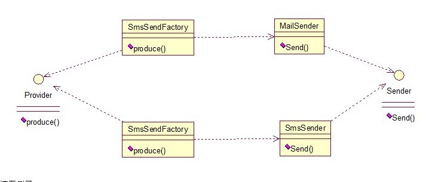

# 抽象工厂模式

工厂方法模式有一个问题就是，类的创建依赖工厂类，也就是说，如果想要拓展程序，必须对工厂类进行修改，这违背了闭包原则，所以，从设计角度考虑，有一定的问题，如何解决？就用到抽象工厂模式，创建多个工厂类，这样一旦需要增加新的功能，直接增加新的工厂类就可以了，不需要修改之前的代码。因为抽象工厂不太好理解，我们先看看图，然后就和代码，就比较容易理解。



请看例子：

```
[java] view plaincopy
	1.	public interface Sender {  
	2.	    public void Send();  
	3.	}  
两个实现类：
[java] view plaincopy
	1.	public class MailSender implements Sender {  
	2.	    @Override  
	3.	    public void Send() {  
	4.	        System.out.println("this is mailsender!");  
	5.	    }  
	6.	}  
[java] view plaincopy
	1.	public class SmsSender implements Sender {  
	2.	  
	3.	    @Override  
	4.	    public void Send() {  
	5.	        System.out.println("this is sms sender!");  
	6.	    }  
	7.	}  
两个工厂类：
[java] view plaincopy
	1.	public class SendMailFactory implements Provider {  
	2.	      
	3.	    @Override  
	4.	    public Sender produce(){  
	5.	        return new MailSender();  
	6.	    }  
	7.	}  
[java] view plaincopy
	1.	public class SendSmsFactory implements Provider{  
	2.	  
	3.	    @Override  
	4.	    public Sender produce() {  
	5.	        return new SmsSender();  
	6.	    }  
	7.	}  
在提供一个接口：
[java] view plaincopy
	1.	public interface Provider {  
	2.	    public Sender produce();  
	3.	}  
测试类：
[java] view plaincopy
	1.	public class Test {  
	2.	  
	3.	    public static void main(String[] args) {  
	4.	        Provider provider = new SendMailFactory();  
	5.	        Sender sender = provider.produce();  
	6.	        sender.Send();  
	7.	    }  
	8.	}  
	
```


其实这个模式的好处就是，如果你现在想增加一个功能：发及时信息，则只需做一个实现类，实现Sender接口，同时做一个工厂类，实现Provider接口，就OK了，无需去改动现成的代码。

